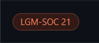
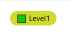
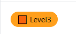
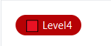

  
<h1 align="center">ISSUE / PR LABELS AND THEIR MEANING</h1>

 <table style="width:100%">
  <tr>
    <th><h2>Issue / PR Label</h2></th>
    <th><h2>Meaning</h2></th>
    
  </tr>
  <tr>
    <td></td>
    <td><h3>This is program label for you contribution to considered for this program your Pull-request should have this label.</h3></td>
  </tr>

  <tr>
    <td></td>
    <td><h3>This is Level 1 Label. This will be added by Project Admin / Mentor to your Pull request on basic of work you done.</h3></td>
  </tr>
  <tr>
    <td></td>
    <td><h3>This is Level 2 Label. This will be added by Project Admin / Mentor to your Pull request on basic of work you done.</h3></td>
  </tr>
  <tr>
    <td></td>
    <td><h3>This is Level 3 Label. This will be added by Project Admin / Mentor to your Pull request on basic of work you done.</h3></td>
  </tr>
  <tr>
    <td></td>
    <td><h3>This is Level 4 Label. This will be added by Project Admin / Mentor to your Pull request on basic of work you done.</h3></td>
  </tr>
  <tr>
    <td></td>
    <td><h3>This is help Label ! If you need help in solving your issue you can ask Project Admin / Mentor to add this label to your  issue ! So others can understand you need help in particular issue !</h3></td>
  </tr>
  <tr>
    <td></td>
    <td><h3>This is Up for Grab label will be added to Issue when any particular issue will be unassigned ! This will help everyone to find issues !</h3></td>
    
  </tr>
  <tr>
    <td></td>
    <td><h3>This is good first issue label ! If any new issue is created and it is easy to be solved by beginners then this label will be added</h3></td>
  </tr>
  
</table> 

    

<h1 align="center">PROJECT LIST WITH PROJECT ADMIN AND MENTORS</h1>

 <table style="width:100%">
  <tr>
    <th><h2>Project</h2></th>
    <th><h2>Project Admin</h2></th>
    <th><h2>Mentors</h2></th>
  </tr>
  <tr>
    <td><h3><a>ABC</a></h3></td>
    <td><h3>ABC</h3></td>
    <td><h3>ABC</h3></td>
  </tr>
    <tr>
    <td><h3><a>ABC</a></h3></td>
    <td><h3>ABC</h3></td>
    <td><h3>ABC</h3></td>
  </tr>
  <tr>
    <td><h3><a>ABC</a></h3></td>
    <td><h3>ABC</h3></td>
    <td><h3>ABC</h3></td>
  </tr>
    <tr>
    <td><h3><a>ABC</a></h3></td>
    <td><h3>ABC</h3></td>
    <td><h3>ABC</h3></td>
  </tr>
  <tr>
    <td><h3><a>ABC</a></h3></td>
    <td><h3>ABC</h3></td>
    <td><h3>ABC</h3></td>
  </tr>
    <tr>
    <td><h3><a>ABC</a></h3></td>
    <td><h3>ABC</h3></td>
    <td><h3>ABC</h3></td>
  </tr>
  <tr>
    <td><h3><a>ABC</a></h3></td>
    <td><h3>ABC</h3></td>
    <td><h3>ABC</h3></td>
  </tr>
    <tr>
    <td><h3><a>ABC</a></h3></td>
    <td><h3>ABC</h3></td>
    <td><h3>ABC</h3></td>
  </tr>
  <tr>
    <td><h3><a>ABC</a></h3></td>
    <td><h3>ABC</h3></td>
    <td><h3>ABC</h3></td>
  </tr>
    <tr>
    <td><h3><a>ABC</a></h3></td>
    <td><h3>ABC</h3></td>
    <td><h3>ABC</h3></td>
  </tr>
  <tr>
    <td><h3><a>ABC</a></h3></td>
    <td><h3>ABC</h3></td>
    <td><h3>ABC</h3></td>
  </tr>
    <tr>
    <td><h3><a>ABC</a></h3></td>
    <td><h3>ABC</h3></td>
    <td><h3>ABC</h3></td>
  </tr>
  <tr>
    <td><h3><a>ABC</a></h3></td>
    <td><h3>ABC</h3></td>
    <td><h3>ABC</h3></td>
  </tr>
    <tr>
    <td><h3><a>ABC</a></h3></td>
    <td><h3>ABC</h3></td>
    <td><h3>ABC</h3></td>
  </tr>
  <tr>
    <td><h3><a>ABC</a></h3></td>
    <td><h3>ABC</h3></td>
    <td><h3>ABC</h3></td>
  </tr>
    <tr>
    <td><h3><a>ABC</a></h3></td>
    <td><h3>ABC</h3></td>
    <td><h3>ABC</h3></td>
  </tr>
  <tr>
    <td><h3><a>ABC</a></h3></td>
    <td><h3>ABC</h3></td>
    <td><h3>ABC</h3></td>
  </tr>
    <tr>
    <td><h3><a>ABC</a></h3></td>
    <td><h3>ABC</h3></td>
    <td><h3>ABC</h3></td>
  </tr>
  <tr>
    <td><h3><a>ABC</a></h3></td>
    <td><h3>ABC</h3></td>
    <td><h3>ABC</h3></td>
  </tr>
    <tr>
    <td><h3><a>ABC</a></h3></td>
    <td><h3>ABC</h3></td>
    <td><h3>ABC</h3></td>
  </tr>

  
  
</table> 

